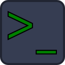
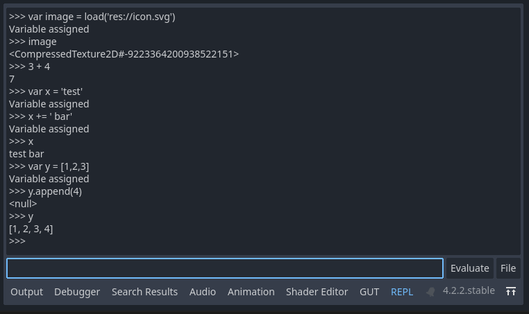

# Read Eval Print Loop for GDScript

A Godot plugin that provides a tab in the Godot editor, which enables interactive code execution.

## Usage
* Type commands into the bar then click `Evaluate` or tap the `enter` key
* Tap up or down to browse your command history
* You can insert file paths by clicking `File`, navigating to a file (or directory), and clicking `Open`

## Installation
Refer to the [Godot documentation for installing a plugin](https://docs.godotengine.org/en/stable/tutorials/plugins/editor/installing_plugins.html).

### Through AssetLib
* Click the `AssetLib` tab and search for `gdscript-repl`
* Find the plugin and install it
* Follow the instructions in the section `Enabling the Plugin`

### Manual Installation
* Download the Zip Archive and unpack it.
* Move the `addons/repl` folder  into your project's `addons/` folder
* Follow the instructions in the section `Enabling the Plugin`

### Enabling the Plugin
* Go to `Project > Project Settings`
* Click the `Plugins` tab
* Click the `Enable` checkbox next to the plugin `gdscript-repl`
* You should see the `REPL` tab at the bottom of the editor

## Contributing
To help, you can
* Submit issues to the github issue tracker
	* If it's a bug, include the steps you took to create the error
	* Include what you expected to happen and what actually happened instead
* Write a unit test that illustrates the problem
	* If you submit unit tests, leave them commented out if you haven't also fixed the problem.
	* You can use the GUT plugin to run the tests
	* You can also use the scripts under `scripts/` to run the unit tests
* Submit pull requests
	* Fix open tickets
	* Propose your own features if you like
	* Get some of the commented out unit tests to pass

## Licensing
Copyright (c) 2024 Justin Bangerter

License: BSD-3
See LICENSE.md
